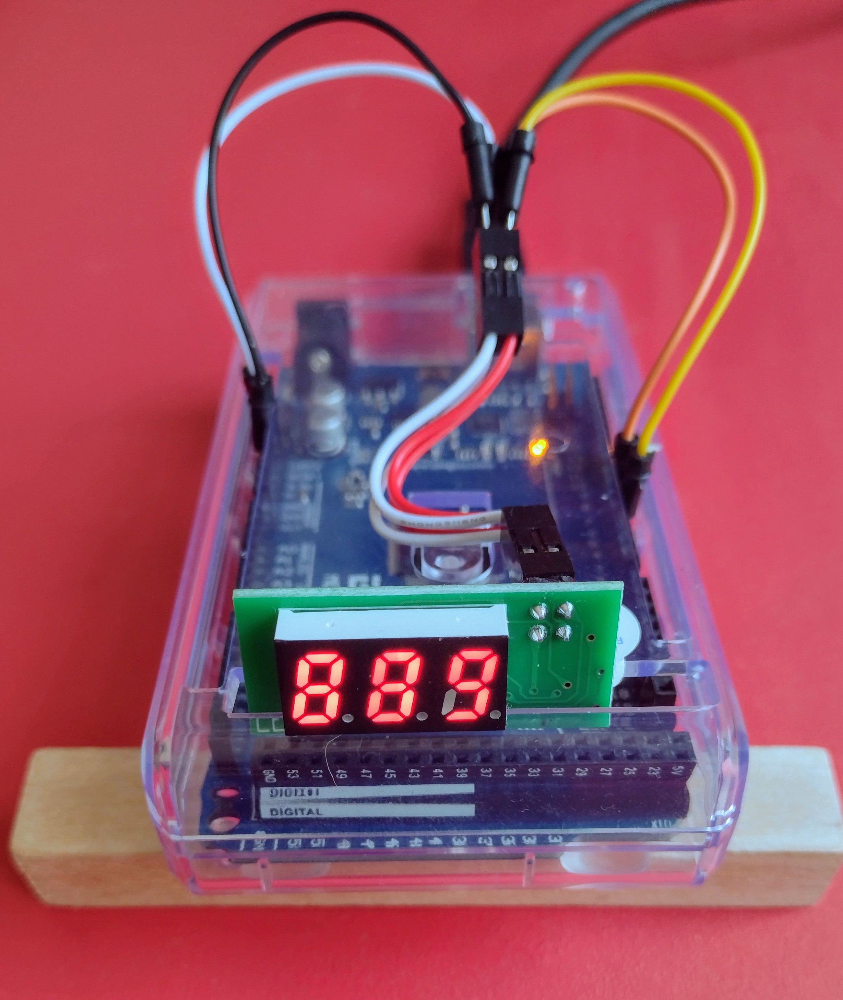

# Gotek-LEDC68
Using an Old Gotek LEDC68 (TM1651 based) 3-Digit LED Board

_**LEDC68 Front**_  

_**LEDC68 Rear**_  

Having recently, like many, upgraded my Gotek drive to use the FlashFloppy firmware, I then went on to do a few hardware mods - including replacing the stock 3-digit LED screen (LEDC68) with a superior OLED screen.

Not wanting to just throw the LEDC68 away, I decided to see if I could do anything with it using my trusty Arduino Mega 2560 R3.

Here is the result... a small library of functions and some demo code to show it in action!

+ **TM1651.ino**: Demo sketch showing the library functions at work.
+ **TM1651.h**: Header file for the function library.
+ **TM1651.cpp**: The library of TM1651 functions.

Now to be fair, there is not a lot that you can do with a 3-digit LED display, but it was fun to work it all out.

## Important information
The LEDC68 uses a TM1651 chip to address the digits and drive the segments. The TM1651 uses a 2-wire serial interface (clock and data), but despite appearances, it is **not** I2C.

_**LEDC68 Circuit**_  

The TM1651 datasheet is also in this archive: **TM1651_V1.1_EN.pdf**

## The Screen on my Mega and Working

**Captured Serial Output**

`Display brightness and digit test.`  
`Demo 1: 8-bit hex count up.`  
`Demo 2: 12-bit hex count up.`  
`Demo 3: 999 decimal count up.`  
`Demo 4: 999 decimal count down.`  
`Demo 5: A 5 minute delay() timer: 301132ms`  
`Demo 6: A 10 minute millis() timer & flashing decimal point: 600002ms`  
`Demo 1: 8-bit hex count up.`  
...etc.

It is interesting to see how quickly the simple 5 minute (delay() function) timer drifts!

## References
Built on work by Derek Cooper. Thank you for the jump start!
+ https://www.instructables.com/Re-use-LEDC86-Old-Gotek-Display/

_**Enjoy!**_
